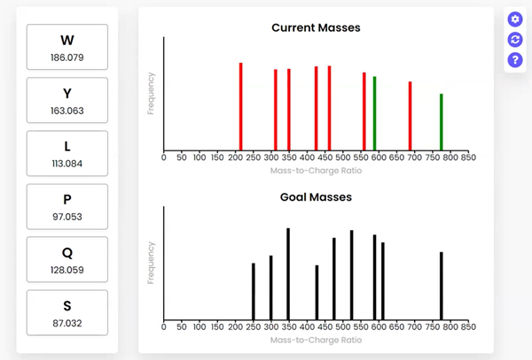

# Peptide Sequencing GUI

## Overview
This project is an extension of the computational biology research I contributed to under Professor Matthew Tien. One of the first projects I worked on was a novel approach to peptide sequencing. Proteomics (the large-scale study of peptides and proteins) is an increasingly powerful and indispensable technology in molecular cell biology (Pandey and Mann, 2000). The foundational technology in mass-spectrometry-based proteomics is peptide sequencing. However, it is often not well understood (Steen and Mann, 2004). Professor Tien was teaching his Intro to Comp Bio (BIOL-250) class about mass spectrometry, the algorithms used, and how to interpret the data. However, he predicted his students would struggle to understand peptide sequencing and mass spectrometry data. This led Professor Tien and me to create the problem statement: how might we develop a tool that helps students in his Intro to Comp Bio (BIOL-250) class understand and interpret peptide sequencing, mass spectrometry, and its data?

## Final Design
The final design is an online graphical user interface (GUI) that visually represents both a random peptide and the simulated mass spectrometry output.

The random peptide is represented by a vertical array of amino acids and their masses (left). These can be dragged and dropped to rearrange their order. Users are given two spectrum outputs (right), which are generated based on the “Current” and “Goal” peptides. By rearranging the order of the amino acids, the “Current Masses” spectrum dynamically responds, helping students understand the relationship between the peptide and mass spectrometry data. The “Goal Masses” are generated based on a hidden “Goal” peptide. When a simulated “current” mass aligns with a simulated “goal” mass, it turns from red to green. When the peptides match, all the masses in the current spectrum turn green.

Users can also hover over the bars, which show the summed amino acid masses of that fragment. Clicking on a bar highlights the amino acid fragments that sum to the clicked frequency. This can be done for current or goal mass frequencies. Clicking goal frequencies will highlight the amino acid fragment that needs to be in order to reconstruct the peptide, which the user can use to sequence the peptide. The graphical representations on the right represent the relative abundance as a function of the mass-to-charge ratio generated from simulating mass spectrometry on the peptide.
